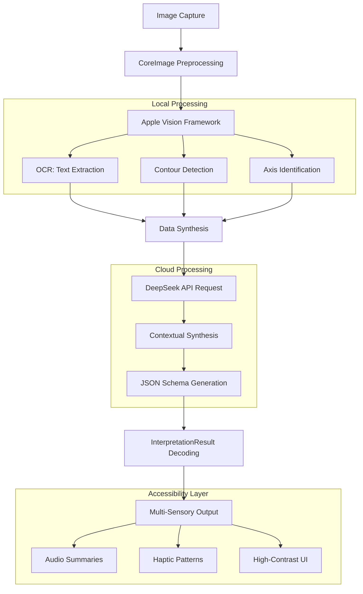

# StatSense

**Making Statistical Data Accessible for Everyone**

StatSense is an iOS accessibility application designed to bridge the gap between visual data and non-visual interpretation. By combining Apple's Vision Framework with the DeepSeek API, StatSense translates static graphs, charts, and diagrams into multi-sensory experiences through audio descriptions, haptic feedback, and high-contrast visual modes.

---

## Why It Matters

STEM education often relies heavily on visual data. For blind, low-vision, or color-blind students, interpreting a simple line graph without assistance can be a significant challenge.

StatSense addresses this problem by:
- **Removing Barriers**: Providing immediate access to visual information without requiring a human assistant.
- **Multi-Sensory Learning**: Utilizing a custom haptic feedback system to give users a physical sense of data trends.
- **Equity in Education**: Enabling students to participate in data-driven subjects with the same independence as their sighted peers.

---

## Key Features

### Audio Interpretation
- **Natural Language Summaries**: Generates clear descriptions of graph trends, axes, and key data points.
- **Screen Reader Integration**: Fully compatible with VoiceOver for seamless navigation.
- **Adjustable Speech**: Customizable audio settings to match individual user preferences.

### Haptic Feedback
- **Trend Patterns**: Distinct vibration patterns represent increasing, decreasing, or fluctuating data.
- **Intersection Alerts**: Physical feedback when data lines cross or meet significant thresholds.
- **Tactile Exploration**: A step-by-step explorer that coordinates haptics with visual cues.

### High-Contrast Visuals
- **Adaptive UI**: A dedicated High-Contrast mode designed for users with significant visual impairments.
- **Color-Blind Safe Palettes**: Curated color schemes optimized for Protanopia, Deuteranopia, and Tritanopia.
- **Global Font Scaling**: A simplified font-size slider that maps to the system's Dynamic Type for app-wide legibility.

---

## Technical Architecture

StatSense uses a two-stage pipeline to analyze images locally and through the cloud:



### 1. Local Vision Processing
- **Image Preprocessing**: Utilizes CoreImage filters to enhance contours and remove background noise.
- **Contour Detection**: Apple's VNDetectContoursRequest extracts the geometric shape of data lines with sub-pixel precision.
- **OCR (Optical Character Recognition)**: VNRecognizeTextRequest captures axis labels, titles, and data points directly on the device.

### 2. API-Driven Interpretation
- **Contextual Synthesis**: Local vision data is fed into the DeepSeek model using structured prompts.
- **Structured Data**: The API returns a strict JSON schema that the app decodes into a type-safe InterpretationResult.
- **Data Translation**: Abstract data points are mapped to human-readable descriptions and haptic instructions.

---

## Installation & Setup

StatSense uses XcodeGen for project management to maintain a clean repository.

### Prerequisites
- macOS Sonoma or later
- Xcode 15.0+
- iOS 17.0+ (Target Device)
- XcodeGen installed (`brew install xcodegen`)

### Getting Started

1. **Clone the repository**:
   ```bash
   git clone https://github.com/username/StatSense.git
   cd StatSense
   ```

2. **Generate the Xcode Project**:
   ```bash
   xcodegen generate
   ```

3. **Configure API Keys**:
   - Open `Config.xcconfig`.
   - Add your DeepSeek API Key:
     `DEEPSEEK_API_KEY = sk-your-key-here`

4. **Run**:
   - Open `StatSense.xcodeproj` in Xcode.
   - Select your Development Team in Signing & Capabilities.
   - Build and run on a physical device to test the haptic features.

---

## Roadmap

- [ ] **Multi-Line Support**: Advanced detection for overlapping data series.
- [ ] **Offline Mode**: Integration of local models for privacy-first analysis.
- [ ] **Complex Diagramming**: Support for structural diagrams and flowcharts.
- [ ] **Braille Integration**: Exporting data tables directly to Refreshable Braille Displays.

---

Developed for Technology Student Association (TSA).
